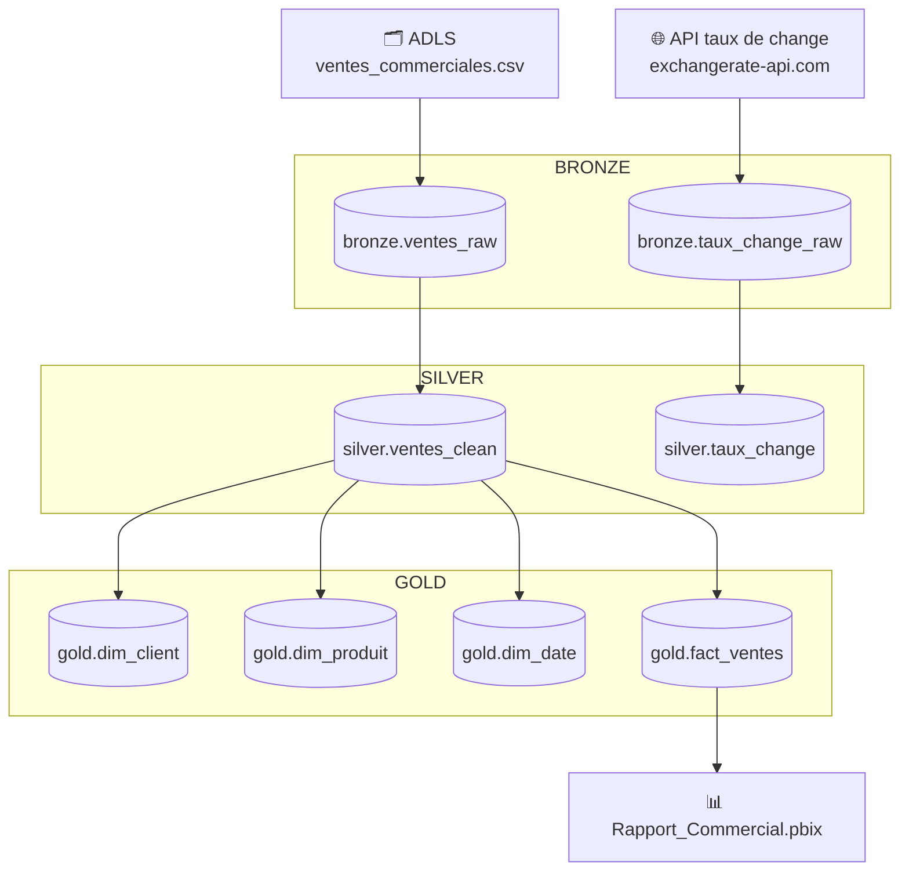
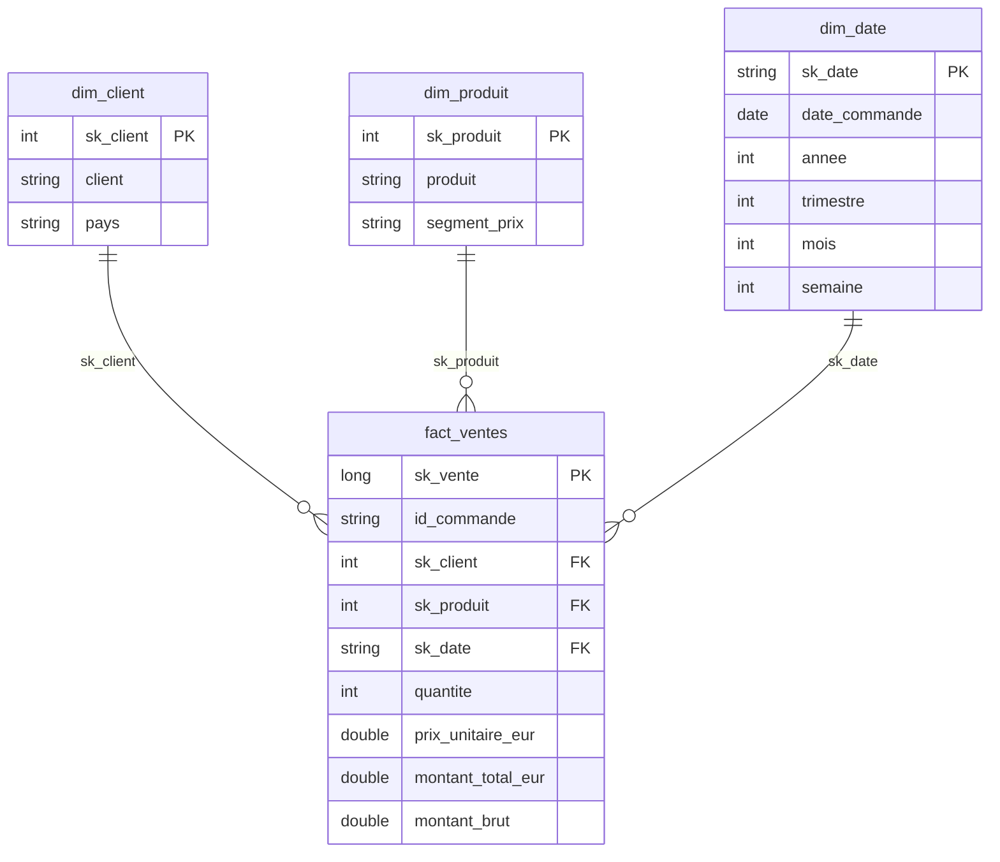

# Projet Databricks Commercial — Pipeline de données & Rapport Power BI

## Vue d'ensemble

Ce projet implémente un pipeline de données end-to-end sur **Azure Databricks** selon l'architecture **Medallion (Bronze → Silver → Gold)**, alimenté par deux sources : un fichier CSV de ventes commerciales stocké sur **Azure Data Lake Storage (ADLS)** et une **API de taux de change** en temps réel. Les données curated sont ensuite exposées dans un rapport **Power BI**.

---

## Architecture



---

## Structure du projet

```
Projet-Databricks-Commercial/
├── 01_bronze_ingestion.sql        # Initialisation des schémas & ingestion Bronze
├── 02_silver_transform.py         # Nettoyage, typage et enrichissement Silver
├── 03_api_pipeline.py             # Appel API taux de change → Bronze & Silver
├── 04_gold_dimensions_facts.py    # Construction du modèle en étoile (Gold)
├── 05_gold_analytics.py           # Requêtes analytiques (top clients par CA)
├── 06_data_quality_tests.py       # Tests de qualité des données Silver & Gold
└── Rapport_Commercial.pbix        # Rapport Power BI connecté à la couche Gold
```

---

## Description des notebooks

### `01_bronze_ingestion.sql`
- Crée les trois schémas Hive Metastore : `bronze`, `silver`, `gold`
- Lit le fichier `ventes_commerciales.csv` depuis ADLS (`abfss://landing@adlscommercialprod2.dfs.core.windows.net/`)
- Ajoute des métadonnées techniques : `_ingestion_ts`, `_source_file`, `_batch_id`
- Écrit la table Delta `bronze.ventes_raw`

### `02_silver_transform.py`
- **Typage** : cast des colonnes `quantite` (Integer), `prix_unitaire_eur` / `montant_total_eur` (Double), `date_commande` (Date)
- **Nettoyage** : trim des champs texte, normalisation `pays` en majuscules
- **Enrichissement** : calcul de `montant_brut`, segmentation prix (`Petit prix` / `Milieu de gamme` / `Premium`)
- **Qualité** : déduplication sur `id_commande`, filtrage des lignes invalides (nulls, quantités/prix ≤ 0)
- Écrit la table Delta `silver.ventes_clean`

### `03_api_pipeline.py`
- Appelle l'API publique `https://api.exchangerate-api.com/v4/latest/EUR`
- Stocke toutes les devises en mode `append` dans `bronze.taux_change_raw`
- Filtre les devises USD, GBP, CHF pour la couche `silver.taux_change`

### `04_gold_dimensions_facts.py`
- Construit le **modèle en étoile** :
  - `dim_client` : clé de substitution `sk_client`, client, pays
  - `dim_produit` : clé de substitution `sk_produit`, produit, segment_prix
  - `dim_date` : clé `sk_date` (format `yyyyMMdd`), décomposition année / trimestre / mois / semaine
  - `fact_ventes` : table de faits partitionnée par `sk_date`, avec jointures sur les dimensions

### `05_gold_analytics.py`
- Requête analytique : **Top clients par chiffre d'affaires**, avec nombre de commandes et pays

### `06_data_quality_tests.py`
- Suite de tests unitaires sur les couches Silver et Gold :
  - Contrôle de nullité sur les colonnes clés
  - Contrôle de positivité sur les montants
  - Contrôle d'unicité sur les clés métier
  - Contrôle de volumétrie minimale

---

## Prérequis

| Composant | Détail |
|---|---|
| Azure Databricks | Runtime ML ou Standard ≥ 13.x |
| Azure Data Lake Storage Gen2 | Container `landing` avec le fichier `ventes_commerciales.csv` |
| Hive Metastore | Activé sur le workspace Databricks |
| Format de stockage | Delta Lake |
| Power BI Desktop | Pour ouvrir `Rapport_Commercial.pbix` |

---

## Ordre d'exécution

```
1. 01_bronze_ingestion.sql
2. 03_api_pipeline.py          ← peut tourner en parallèle avec le notebook 1
3. 02_silver_transform.py
4. 04_gold_dimensions_facts.py
5. 06_data_quality_tests.py    ← valider avant de publier
6. 05_gold_analytics.py        ← exploration / vérification
```

---

## Modèle de données Gold



---

## Tests de qualité

Le notebook `06_data_quality_tests.py` vérifie automatiquement :

| Test | Couche | Colonne(s) |
|---|---|---|
| Aucune valeur NULL | Silver | `id_commande`, `client`, `produit` |
| Montants positifs | Silver | `montant_total_eur` |
| Aucun doublon | Silver | `id_commande` |
| Volumétrie ≥ 1 ligne | Silver | — |
| Aucune valeur NULL | Gold | `sk_client`, `sk_produit`, `sk_date` |
| Montants positifs | Gold | `montant_total_eur` |

Un `assert` échoue avec un message clair (`❌ FAIL`) si une règle n'est pas respectée. Tous les succès sont confirmés par `✅`.

---

## Rapport Power BI

Le fichier `Rapport_Commercial.pbix` se connecte directement aux tables Gold du Hive Metastore Databricks. Il expose notamment :
- Le chiffre d'affaires par client et par pays
- L'évolution temporelle des ventes
- La distribution par segment de prix produit

---

## Auteur

Projet réalisé dans le cadre d'un pipeline commercial sur Azure Databricks avec intégration Power BI.
